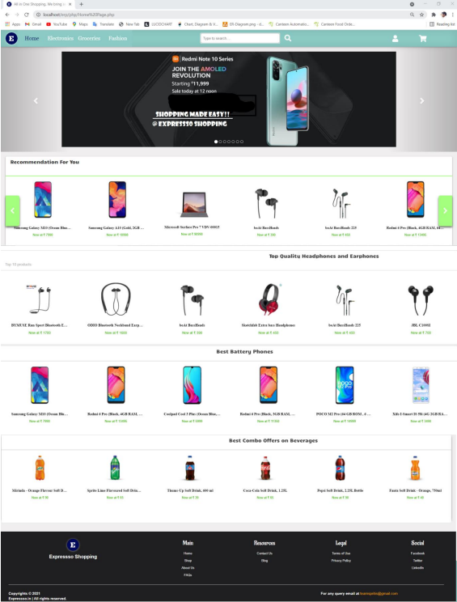
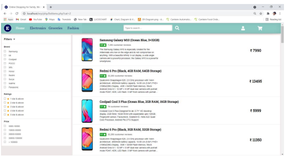
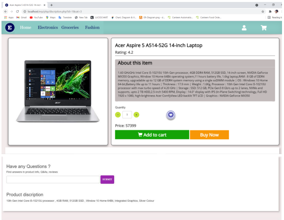
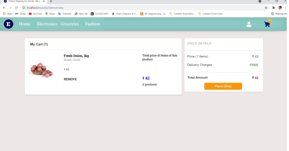
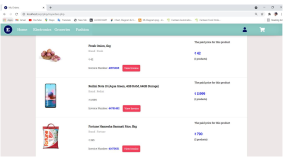
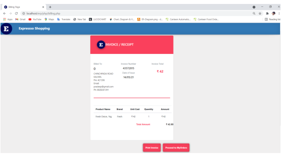
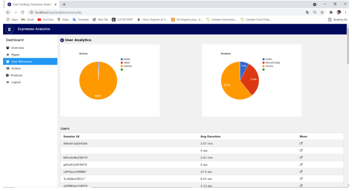
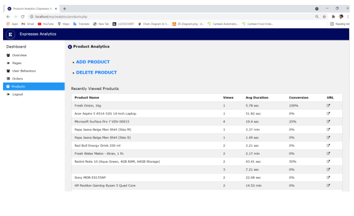

# EXPRESSSO-ECOMMERCE WEBSITE

Expressso project is about doing the business of shopping over the internet which is an E-Commerce website. The objective of this project is to setup a virtual store on the internet  i.e an E-Commerce store where products like groceries, clothes, gadgets can be bought easily.

## Technologies used in the project

<h2>Front-end:</h2>
- HTML, JavaScript, CSS

<h2>Back-end:</h2>
- PHP, MySQL

## MODEL:

* Agile model.

## Deployement on 000webhostapp

## Future Scope

* With the penetration of the internet and smartphones to the 
more remote areas, a number of people would opt for online 
shopping as they have lesser facilities for shopping online.
* Personalized Shopping Experience Facilitated By Machine 
Learning.
* We would be using a variety of tools for customer data 
analysis and getting the most relevant data-driven 
insights for our marketing and business decisions.

